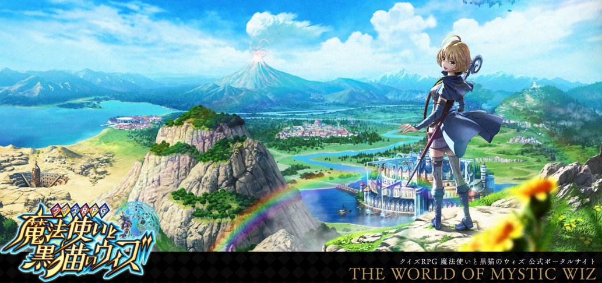

# クイズ RPG 魔法使いと黒猫のウィズ : 問題自動解(퀴즈RPG 문제 자동풀이 모델 개발)



<table>
  <tr>
    <th>프로젝트 PPT(PDF형식)</th>
    <td><a href="https://drive.google.com/file/d/16M-QNuhGiY1aqKU3FcczcGnh8uZI-iw-/view?usp=sharing">링크</a></td>
  </tr>
  <tr>
    <th>유튜브 링크(시연영상)</th>
    <td><a href="https://youtu.be/8585RRw_u6s?si=Q1xkRHRBEGNTVIpk">링크</a></td>
  </tr>
</table>

### 실행 방법

1. 파일을 다운로드 받습니다.
2. 파일을 압축 해제합니다.
3. 압축 해제된 폴더로 이동합니다 (黒猫(PART))
4. 콘솔 창을 키고, 다음과 같은 커맨드를 입력합니다

```
Copy codeflask db init
flask db migrate -m "init"
flask db upgrade
flask run
```

5. 브라우저에서 http://127.0.0.1:5000/ 을 입력합니다.

<hr>
